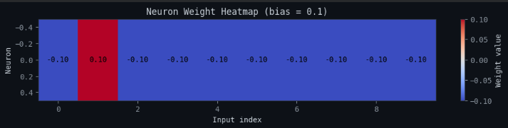

# Neuron from Scratch

This project implements a single artificial neuron (Perceptron) from scratch using pure Python, without relying on external machine learning libraries.

The purpose of this experiment is to provide a transparent and reproducible view of how a neuron operates internally, including forward computation, activation, error calculation, and parameter updates.

This repository is intended for educational, research, and foundational machine learning understanding.

---

# Mathematical Model

The neuron implements the following linear model:

```
z = Σ(wᵢ · xᵢ) + b
```

Where:

* `x` → input vector
* `w` → weight vector
* `b` → bias
* `z` → linear output

The activation function converts the linear output into a binary prediction:

```
a = step(z)
```

---

# Neuron Learning Process

A neuron performs four fundamental operations during training:

## 1. Forward Pass

The neuron computes the weighted sum of inputs:

```
z = w · x + b
```

This represents the neuron’s raw output before activation.

---

## 2. Activation Function

The activation function determines whether the neuron activates:

```
a = 1 if z > 0
a = 0 otherwise
```

This converts the linear output into a binary classification.

---

## 3. Loss Computation

The error is calculated by comparing the prediction with the expected value:

```
error = expected − prediction
```

This measures how incorrect the neuron’s output is.

---

## 4. Backward Pass (Parameter Update)

The neuron updates its weights and bias using the Perceptron learning rule:

```
w = w + learning_rate · error · x
b = b + learning_rate · error
```

This allows the neuron to gradually learn the correct decision boundary.

---

# Training Objective

The neuron is trained to recognize a specific binary pattern:

```
[0,1,0,0,0,0,0,0,0,0]
```

The model learns to:

* Activate (output = 1) for the target pattern
* Not activate (output = 0) for all other patterns

This creates a binary linear classifier.

---

# Visualization

This repository includes a visualization:



The visualization generates a heatmap representing the learned weights.

This heatmap allows direct inspection of which inputs most influence neuron activation.

Key observation:

* The second weight has the highest value.
* This occurs because the second input position is the defining feature of the target pattern.
* This demonstrates that the neuron correctly learned the most relevant feature.

This type of visualization is commonly used in neural network interpretability research.

---

# Repository Structure

```
project/
│
├── perceptron.py       # Main neuron implementation and training
├── visualization.py    # Weight heatmap visualization
├── README.md
```

---

# Limitations

This implementation demonstrates the fundamental mechanism of a neuron, but has important limitations:

* Only learns linearly separable problems
* Cannot learn complex patterns
* Limited generalization capacity
* Single neuron only

Modern neural networks overcome these limitations by stacking many neurons into layers.

---

# Author

Marcos Júnior Lemes Ferreira

---

# License

MIT License
